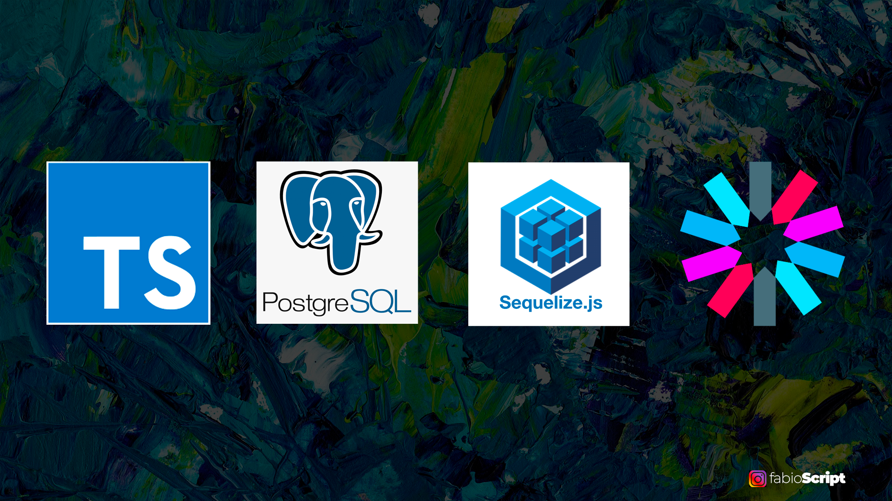

# REST API - Typescript + Express + Postgres + Sequelize + JWT
 

 
 
### 🎛️ Dependencias
 
- [Typescript](https://www.typescriptlang.org/)
- [Sequelize](https://sequelize.org/)
- [JWT](https://jwt.io/)
- [Express](https://expressjs.com/pt-br/)
 
### 🎯 Objetivo
 
Criar uma API Rest com os princípios de arquitetura limpa que forneça rotas para ações de:
- Listagem
- Criação
- Edição
- Remoção
 
 
 
### ⌨️ Como foi feito?
 
O `Express.js` fornece todo o ambiente inicial para tratamento de rotas que foi preciso para iniciar o projeto. O banco de dados foi modelado com ajuda do `Sequelize` de onde também provém as principais *querys* SQL para suas consultas e ações.
 
O `Typescript` assegura que os parâmetros passados e utilizados de outras bibliotecas respeitem os tipos estipulados, assim como as alterações cabíveis para as regras de negócio.
 
A única rota pública é a `/login` de onde o `JWT` consegue emitir o ***token*** de autorização para o usuários logado, onde pode esse ***token*** pode ser checado futuramente em outras rotas.
 
### 🛣️ Rotas
- `post/login` - onde o usuários precisa enviar um json com informações de email e senha.
- `get/usuarios` - onde o usuário **autenticado** pode verificar a lista de usuários cadastrados no banco de dados.
- `post/usuarios` - onde o usuário **autenticado** pode criar um novo usuários passando um json com as informações de login.
- `get/usuarios/:id` - onde o usuário **autenticado** pode verificar o registro de um usuário especificando passando seu valor de ***id***.
- `put/usuarios/:id` - onde o usuário **autenticado** pode editar o registro de um usuário passando o ***id*** como parâmetro e enviando um json com as novas informações.
- `delete/usuario/:id` - onde o usuário **autenticado** pode excluir um registro passando o ***id*** como parâmetro.
 
### 🔎 Como utilizar
 
- `git clone` no link do repositório
- Instalado em sua máquina você precisará instalar as dependências do projeto.
- `npm install`
- Rode o script configurado `npm run dev`, para abrir o ambiente de desenvolvimento.
- `tsc`, para transpilar os arquivos `.ts` para `.js` da pasta dist.
- Foi utilizada a extensão do VsCode `Thunder Cliente` para fazer as requisições HTTP.
 
### 🔧 Próximos passos
 
- Tratamento de excessões
- Testes de unidade e automatizados com Jest
 
### 🎨 Autor
 
[LinkedIn](https://www.linkedin.com/in/fabiodeandrad/)
[Medium](https://medium.com/@fabioscript)
[E-mail](fabiodeandradecontato@gmail.com)
 
 

